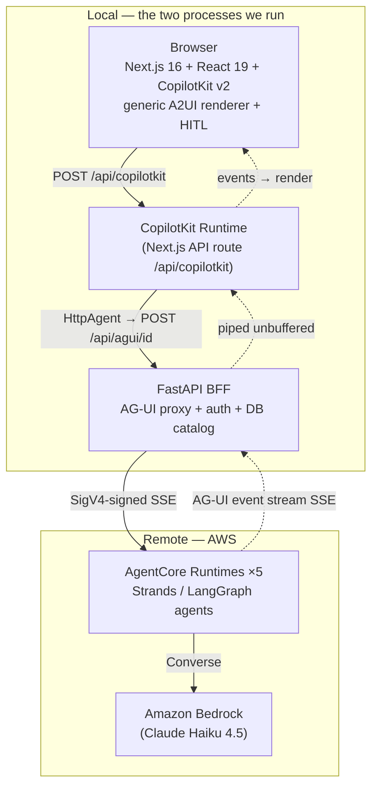
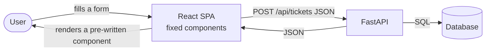
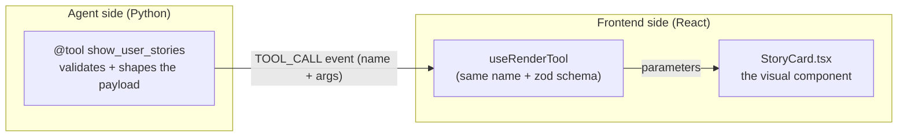
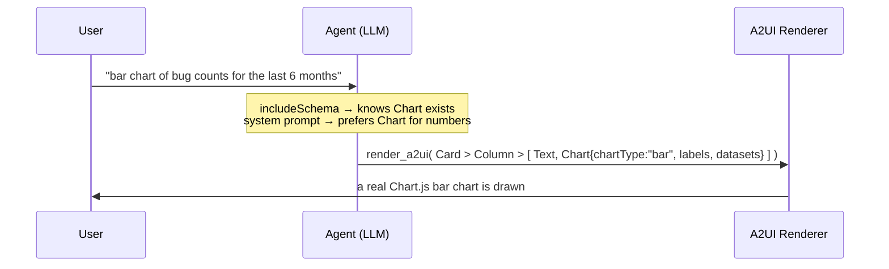
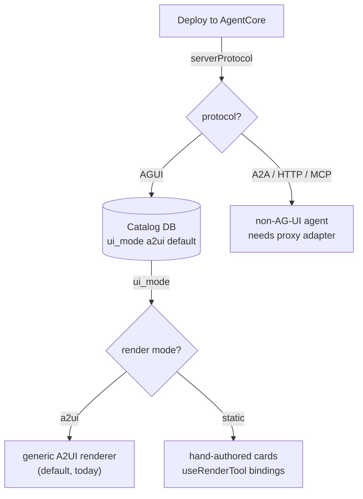

# From React + FastAPI to AG-UI and A2UI
### How adding an agent changes *who* builds the UI — cards, shared state, generative UI, and render modes

> **How to read this document.** It is written to serve two audiences at once:
> - **Management / decision-makers** — read the `📋 In plain terms` callout at the
>   top of each section and the *Executive summary* and *Wrap-up*. You can skip every code block.
> - **Engineers** — the `🔧 Under the hood` parts, code, and diagrams are the build recipe.
>
> It is also a slide deck: `---` marks a slide boundary and `> Notes:` blocks are
> speaker notes. Every code snippet is taken from the real `Phase0/` codebase
> (paths are given), so it doubles as an onboarding reference.
>
> Items marked **`[research this]`** are deliberate gaps to be filled by a follow-up
> deep-research pass; they are collected in the final *Open research items* appendix.

---

## Executive summary (for management)

We built a platform where **AI agents produce the user interface**, not just text.
There are four capabilities to understand, from simplest to most powerful:

| Capability | One-line meaning | Who writes the UI | Cost to add something new |
|---|---|---|---|
| **1. Predefined cards** (AG-UI) | The agent picks *which* pre-built card to show and fills it with data | Developer writes the card once; agent chooses it | A new card + a new tool (two small files) |
| **2. State-sharing UI** | A live panel that mirrors the agent's internal state (progress, findings) as it works | Developer writes the panel once | Usually nothing — it reads whatever state the agent shares |
| **3. A2UI (generative UI)** | The agent *designs the screen itself* at runtime from a palette of components | Nobody — a generic renderer paints the agent's design | Often **zero code**; occasionally one reusable component |
| **4. Render modes** | A per-agent switch that lets brand-critical, generative, and even non-AG-UI agents all live on one platform | Configuration, not code | A database field — no redeploy |

**The business point:** as we move down that list, the developer moves *out of the
loop* for routine UI work. New output types (a chart, a diagram, a form) stop being
"a project" and become "the agent's decision at runtime." The platform stays **fully
generic** — any agent we deploy shows up and works with **zero per-agent frontend or
backend code**.

> Notes: This slide is the whole talk in one table. If a stakeholder remembers only
> one thing: the cost of "add a new screen" collapses from *a development cycle*
> (cards) to *a config change or nothing at all* (A2UI + render modes). The rest of
> the deck shows how, with real code.

---

## Verification status (last verified 2026-07-14)

> **📋 In plain terms:** the platform was exercised end-to-end against the **live,
> deployed AgentCore agents** on 2026-07-14. The core flows work; a couple of
> items are wiring/config, not blockers.

> **⚠️ Not re-verified since 2026-07-14.** Three changes landed on 2026-07-15 that bear
> on the rows below: **#19** rebound every agent to **port 8080** (the AgentCore
> health-check contract — `a2ui-demo` was on 8090, `press-release` on 8091), **#20**
> forked the LLM provider (last row), and **#21** corrected the default-branch note.
> Re-run `scripts/smoke_test.py` against the redeployed runtimes before quoting the ✅
> rows in a demo.

| Flow | Status | Evidence |
|---|---|---|
| Backend boot + **AgentCore catalog sync** (5 agents discovered) | ✅ verified | backend logs: "catalog synced from AgentCore: 5 AG-UI runtime(s)" |
| **Planner** — story cards → estimates → **ticket-approval HITL** (pause + resume) | ✅ verified | `scripts/smoke_test.py` S1–S3 PASS; approval contract `{decision, note}` confirmed |
| **Release** — streaming **shared state** (13 progress updates) + checklist/risk + **go/no-go interrupt** | ✅ verified | smoke_test S4–S5 PASS; interrupt resumes on `{decision, note}` |
| **A2UI** — chat surface loads, agent connects, `render_a2ui` run reaches AgentCore | ✅ verified | browser: `/api/copilotkit/agent/a2uidemo/run` 200; A2UI middleware `/info` mounts renderer |
| Frontend **build + lint**, backend imports, `ruff` | ✅ green | `npm run build` + `npm run lint` clean; `ruff check` clean |
| `ui_mode=static` **frontend branch** + admin control | ⏳ designed, not wired | Part 7 (dormant field; ~1–2 day wiring) |
| Enterprise LLM provider — **forked, not configured** (#20) | ✅ code-verified | `Phase0/agents/*/model_factory.py` is **Bedrock-only**; `cloud_deploy/agents/*/model_factory.py` is **gateway-only** (`x-api-key`). No env var can cross them; `cloud_deploy/scripts/check_agent_sync.sh` gates drift. See AGENTS.md invariant 4 |

> Notes: The one caveat from live testing: a browser A2UI run can surface an HTTP 500
> that is actually an **expired AWS SSO session** on the backend
> (`LoginRefreshRequired` during SigV4 signing), not an app bug — re-authenticate AWS
> before a demo. The smoke test passed minutes earlier with valid creds. Full findings
> and fixes live in `Phase0/docs/DEBUG-AND-IMPLEMENTATION-PLAN.md`.

---

## The compass question for the whole talk

At every stage we ask the **same single question**:

> ### "Who produces the UI that appears on screen?"

| Stage | Who produces the UI? | What does "add a feature" mean? |
|---|---|---|
| **1. Classic** React + FastAPI | The developer, at build time | Write a new page + a new endpoint |
| **2. + AG-UI cards** (CopilotKit) | Developer writes the card, **the agent picks the card + data** | Define a new card + a new tool |
| **3. + A2UI** | **The agent generates the UI itself, at runtime** | No cards — just extend a shared component catalog |

> Notes: This is our compass. The three stages are **not** mutually exclusive — they
> run mixed on the same platform, per-agent, selected by a render-mode flag we'll
> cover at the end. Nothing here throws away your React + FastAPI investment; each
> stage layers on top of the previous one.

---

## What is actually running (grounding)

The concrete system this document describes:



- **5 agents today:** `sdlc-planner-strands`, `release-readiness-langgraph`,
  `bug-report-strands`, `a2ui-demo-strands`, `press-release-strands`. Two frameworks
  (Strands + LangGraph), one uniform contract.
- **The backend is a thin proxy.** It authenticates the caller, SigV4-signs the call
  to AgentCore, and **pipes the AG-UI SSE stream back unbuffered**. It never
  interprets or reshapes the stream.
- **The catalog is DB-backed and AgentCore-synced.** No agent id or ARN lives in env;
  agents are discovered from AgentCore and upserted into a database. The app is
  **fully generic** — there is no per-agent code anywhere.

> Notes: Keep this architecture in your head — every capability below plugs into this
> same picture. React + FastAPI never disappeared; we inserted the AG-UI protocol and
> the CopilotKit runtime in between, and the FastAPI role shifted from "REST data
> server" to "agent proxy / BFF."

---
---

# PART 1 — The baseline
## React + FastAPI, no agent-driven UI

---

## The classic world

> **📋 In plain terms:** a normal web app. The developer builds every screen by hand
> ahead of time. If the AI is involved at all, it can only return **text** into a chat
> bubble — it cannot decide what the screen shows.

**🔧 Under the hood:** a form-based request/response loop.



| Limitation | Why it hurts |
|---|---|
| The LLM can only produce **text** | No rich components on screen — a chatbot bubble is the ceiling |
| Every new screen = new code + deploy | The UI vocabulary is frozen at build time |
| Interaction is "one shot" | No "approve this first" step mid-conversation |
| The model and the UI are decoupled | The model can't decide *what to show*, only *what to say* |

> Notes: The key message: in this architecture the LLM's hands are tied. Everything
> that follows is about untying them — first a little (cards), then completely (A2UI).

---
---

# PART 2 — AG-UI + CopilotKit
## The protocol that lets an agent drive the UI

---

## What is AG-UI? In one sentence

> **AG-UI** is a **standard event protocol** (streamed over SSE) spoken between an
> agent and a UI. The agent no longer returns "text" — it returns an **event stream**.

```
RUN_STARTED
TEXT_MESSAGE_START / _CONTENT / _END     ← chat text
TOOL_CALL_START / _ARGS / _END           ← "show THIS card with THIS data"
STATE_SNAPSHOT / STATE_DELTA             ← shared live state (Part 4)
CUSTOM (interrupt, emit_state, …)        ← HITL pauses, custom signals
RUN_FINISHED
```

> **📋 In plain terms:** think of AG-UI as "HTTP for agents" — a shared language. The
> big shift is that the model now decides not just *what to say* but *what to show*.

**🔧 Under the hood — the three parts of CopilotKit** (the library that implements
both ends of AG-UI):

| Part | Where (real path) | Job |
|---|---|---|
| **Runtime** | `app/api/copilotkit/[[...path]]/route.ts` | Registers each agent as an `HttpAgent` pointed at the backend; forwards the `Authorization` header |
| **Provider** | `<CopilotKitProvider>` + `<CopilotChat>` (`components/AgentChat.tsx`) | Supplies the chat UI + the agent connection + the A2UI catalog |
| **Hooks** | `useRenderTool`, `useHumanInTheLoop`, `useInterrupt`, `useAgent` | **Bind agent events to React** — the heart of cards, HITL, and state |

The runtime wires agents **dynamically from the DB catalog** — no hardcoded ids:

```ts
// app/api/copilotkit/[[...path]]/route.ts  (trimmed)
const catalog = await fetchCatalogAgents(request.headers.get("authorization"));
const agentIds = catalog.map((a) => a.id);           // whatever is deployed + synced

const runtime = new CopilotRuntime({
  agents: ({ request }) => {
    const authorization = request.headers.get("authorization");
    const headers = authorization ? { Authorization: authorization } : {};
    // one HttpAgent per catalog id -> the AG-UI proxy route for that id
    return Object.fromEntries(
      agentIds.map((id) => [id, new HttpAgent({ url: `${BACKEND_URL}/api/agui/${id}`, headers })]),
    );
  },
  // First-class A2UI for EVERY agent (covered in Part 5)
  ...(agentIds.length > 0 ? { a2ui: { agents: agentIds, injectA2UITool: true } } : {}),
});
```

> Notes: The `agents` factory grabs the Authorization header on every request and
> carries it to the backend — the "self-hosted runtime" pattern: agents are
> registered server-side, the browser never connects to an agent directly. Note the
> list is built from `/api/agents` at first request, so any newly-deployed agent
> becomes reachable with **no code change** — restart the frontend to pick it up.

---
---

# PART 3 — Predefined cards (AG-UI genUI)
## The agent picks a pre-built component; we write it

---

## A card is a *contract*, written on both sides

> **📋 In plain terms:** a "card" is a nice-looking, branded UI block (a story list, an
> estimate table, an approval dialog). The developer builds the block once. From then
> on, the **agent decides when to show it and what data goes in it**. The look is 100%
> under our control; the content is the agent's decision.

**🔧 Under the hood — the contract is a tool name + an argument schema:**



The agent guarantees *what data* it produces; the frontend guarantees *how it looks*.
What binds them is the **tool's name + its argument schema**, kept consistent in both
places. (This duplication is exactly what A2UI removes in Part 4.)

We distinguish **two kinds of card**:

| Kind | What it does | CopilotKit hook | Runs where |
|---|---|---|---|
| **Static card** (display-only) | *Shows* data. One-way. No user input flows back | `useRenderTool` | Renders and it's done |
| **Dynamic card** (interactive / HITL) | *Shows and returns* — waits for the user, **pauses the agent run**, resumes with the answer | `useHumanInTheLoop` (Strands) / `useInterrupt` (LangGraph) | Blocks the run until the user acts |

> Notes: "Static vs dynamic" here means *display-only vs interactive*, not "hand-coded
> vs generated" (in that second sense **both** are static — both are pre-written React).
> We pick this axis because it maps to two different CopilotKit hooks and two very
> different UX behaviours (fire-and-forget vs pause-the-agent).

---

## Static card — the AGENT side (Python / Strands)

The agent defines a `@tool` that **shapes and validates** the data. The LLM decides
the content; the code enforces the guarantee.

```python
# agents/sdlc-planner-strands/tools.py  (trimmed)
from strands import tool

@tool
def show_user_stories(stories: list[dict]) -> dict:
    """Display drafted user stories as cards in the UI. Call exactly once with all stories.

    Args:
        stories: list of {id, title, acceptance_criteria[], priority in high|medium|low}
    """
    shaped = []
    for i, story in enumerate(stories):
        priority = str(story.get("priority", "medium")).lower()
        if priority not in {"high", "medium", "low"}:
            priority = "medium"
        shaped.append({
            "id": str(story.get("id") or f"US-{i+1}"),
            "title": str(story.get("title", "")).strip(),
            "acceptance_criteria": [str(c) for c in (story.get("acceptance_criteria") or [])],
            "priority": priority,
        })
    return {"stories": shaped}
```

The agent learns *when* to call it from its system prompt, and the tool is registered
on the agent:

```python
# agents/sdlc-planner-strands/agent.py  (trimmed)
SYSTEM_PROMPT = """You are an SDLC planning assistant...
For story generation draft 3 to 5 user stories with acceptance criteria and
call show_user_stories exactly once with all of them...
Keep chat text short, the cards carry the detail."""

agent = Agent(model=build_strands_model(), system_prompt=SYSTEM_PROMPT,
              tools=[show_user_stories, show_estimates])
```

> Notes: The tool has two jobs — (1) advertise the capability to the LLM (it reads the
> docstring), and (2) make the model's raw output safe (validation). We never have the
> model *draw* the UI here, only produce *data*.

---

## Static card — the FRONTEND side (React / CopilotKit)

Bind the **same tool name** to a zod schema + a component with `useRenderTool`:

```tsx
// pattern for a display-only card (the ui_mode=static path — see Part 6)
import { useRenderTool } from "@copilotkit/react-core/v2";
import { z } from "zod/v3";                       // ← zod v3, see gotchas

const storySchema = z.object({
  stories: z.array(z.object({
    id: z.string(),
    title: z.string(),
    acceptance_criteria: z.array(z.string()),
    priority: z.enum(["high", "medium", "low"]),
  })),
});

function PlannerCards() {
  useRenderTool({
    name: "show_user_stories",                    // ← SAME name as the agent's @tool
    parameters: storySchema,
    render: ({ parameters }) => <StoryCard stories={parameters.stories} />,
  }, []);
  return null;
}
```

`StoryCard` is an ordinary, fully-branded React component — style, layout, colours are
ours. Because tool args stream in, the component must tolerate **partial** data.

> **⚠️ Current-state note (honesty):** the *live* frontend today mounts a **generic
> A2UI renderer for every agent** and does **not** bind per-agent display cards. So a
> `show_user_stories` call currently renders as a small **fallback status line**
> (`✓ tool: show_user_stories`) via `useDefaultRenderTool`, unless you add a
> `useRenderTool` binding like the one above. Wiring these bindings per-agent is
> exactly what the `ui_mode=static` render mode is for (Part 6). Interactive cards
> (next slide) **are** wired today.

```tsx
// components/AgentChat.tsx  (what's mounted today — the catch-all)
function FallbackRender() {
  useDefaultRenderTool({
    render: ({ name, status }) => (
      <div style={{ padding: 6, color: "#888", fontSize: 13 }}>
        {status === "complete" ? "✓" : "⏳"} tool: {name}
      </div>
    ),
  }, []);
  return null;
}
```

> Notes: This is the most important honesty slide. The *mechanism* for static cards is
> `useRenderTool` and it's a first-class CopilotKit feature; the *current wiring*
> favours generic A2UI, with a fallback so no tool call silently disappears. Both are
> true and both belong in the deck. `[research this]` the exact `useRenderTool`
> signature / partial-args semantics in CopilotKit 1.62.x to document them precisely.

---

## Dynamic card — interactive Human-in-the-Loop (HITL)

> **📋 In plain terms:** some cards don't just *show* — they *ask*. "Approve these
> tickets?" "Go or no-go on the release?" The agent **stops and waits** for a human
> click, then continues with that decision. This is how we keep a person in control of
> consequential actions.

**🔧 Under the hood — the key rule: HITL tools are owned by the FRONTEND, not the agent.**
CopilotKit sends each HITL tool's definition to the agent in `RunAgentInput.tools`;
the AG-UI adapter (`ag-ui-strands` / `ag-ui-langgraph`) registers it as a **client-proxy
tool**; the agent calls it by name; the run **pauses**; `respond(value)` resumes it.

```tsx
// components/hitl/HumanInTheLoop.tsx  (trimmed — the SDLC Planner's approval)
import { useHumanInTheLoop, useInterrupt } from "@copilotkit/react-core/v2";
import { z } from "zod/v3";

useHumanInTheLoop({
  name: "request_ticket_approval",
  description: "Ask the user to approve or reject creating the proposed tickets.",
  parameters: z.object({
    summary: z.string(),
    tickets: z.array(z.object({ title: z.string(), points: z.number() })),
  }),
  render: (p) => (
    <ApprovalCard status={p.status} respond={p.respond} args={p.args} />
    // p.args = the streamed arguments; p.respond(value) resumes the paused agent
  ),
});
```

On the agent side the tool is **deliberately absent** — it only *calls the name*:

```python
# agents/sdlc-planner-strands/tools.py
# request_ticket_approval is intentionally NOT defined here. It is a HITL tool
# owned by the frontend; ag-ui-strands registers it as a client proxy tool and
# the run pauses until the browser returns the decision.
```

> Notes: The critical trap: if you accidentally define a HITL tool on the agent, it
> runs server-side and the pause/human step is lost. HITL tools are a **contract the
> frontend owns**. This whole feature was recently re-established in the codebase
> (`restore-hitl`), so it is live today.

---

## Dynamic card — the LangGraph flavour (`useInterrupt`)

Strands uses client-proxy tools; **LangGraph** pauses with a native `interrupt()`. Same
UX, different plumbing — and the frontend has a matching hook.

```python
# agents/release-readiness-langgraph/graph.py  (trimmed — the recommend node)
from langgraph.types import interrupt

decision = interrupt(
    {"tool": "request_go_nogo", "recommendation": recommendation, "reasons": reasons}
)
# graph blocks here; resumes with whatever the browser sends back as `decision`
```

```tsx
// components/hitl/HumanInTheLoop.tsx  (trimmed — the release go/no-go)
useInterrupt({
  agentId,
  render: ({ event, resolve }) => {
    const v = (event?.value ?? {}) as { tool?: string; recommendation?: string; reasons?: string[] };
    if (v.tool && v.tool !== "request_go_nogo") return <></>;
    return <GoNoGoInterrupt recommendation={v.recommendation} reasons={v.reasons} resolve={resolve} />;
  },
});
```

The **five HITL surfaces wired today** (all generic, no per-agent frontend files):

| Tool | Agent | Hook | Returns |
|---|---|---|---|
| `request_ticket_approval` | planner | `useHumanInTheLoop` | `{decision, note}` |
| `draft_bug_report` | bug-report | `useHumanInTheLoop` | edited form fields |
| `ask_choice` | press-release | `useHumanInTheLoop` | `{choice}` |
| `draft_press_release` | press-release | `useHumanInTheLoop` | edited draft |
| `request_go_nogo` | release | `useInterrupt` | `{decision, note}` |

> Notes: One `<HumanInTheLoop agentId={id} />` component registers all five for every
> agent. An agent simply calls a name; if it's one of these, the card appears and the
> run pauses. Note `useHumanInTheLoop` exposes `p.args`, while `useRenderTool` exposes
> `parameters` — a small but real CopilotKit v2 API difference. `[research this]` the
> exact response-shape contract for `draft_bug_report` / `ask_choice` /
> `draft_press_release` (confirm with an in-browser round-trip).

---

## Adding a NEW card — the checklist

> **📋 In plain terms:** adding a new card is a small, well-defined developer task —
> two files and a naming agreement. It is *not* zero-cost (that's Part 4), but it's
> cheap and gives pixel-perfect, branded results.

**🔧 Under the hood:**

1. **Agent side** — write a `@tool` (static) *or* nothing at all (HITL: the frontend
   owns it). Add a line to the system prompt telling the model *when* to call it.
2. **Frontend side** — write the React component. Bind it by tool name:
   - display-only → `useRenderTool({ name, parameters, render })`
   - interactive → `useHumanInTheLoop({ name, parameters, render })` and call
     `respond()` on click (or `useInterrupt` for LangGraph).
3. **Keep the schema identical** on both sides (the contract).

**When to use cards:** brand-critical, repeated, high-polish flows (an approval dialog,
a bug-report wizard, a press-release editor). The look must be exact and consistent.

**The ceiling:** every new UI type = a new card + tool + a schema in two places, fixed
at build time. "Now also show it as a radar chart" is impossible unless that card was
written beforehand. Part 4 removes this ceiling.

> Notes: This is the "scorecard" for cards — huge jump over plain text (streaming,
> HITL, branded components, the model drives the UI), but the model can only trigger
> components **we wrote first**. Every new visualization re-enters the developer loop.

---
---

# PART 4 — State-sharing UIs
## A live mirror of the agent's mind

---

## Shared state, not just messages

> **📋 In plain terms:** besides the chat and the cards, an agent can broadcast its
> **internal state** as it works — "step 2 of 3: assessing risks", the checks it
> found, the risks it derived. The UI shows a **live panel** that updates in real time.
> Think of a progress bar or an inspector that reflects what the agent is doing *right
> now*, separate from the final answer.

**🔧 Under the hood — AG-UI `STATE_SNAPSHOT` / `STATE_DELTA` events.** The agent emits
state; the frontend subscribes and renders it. It is continuous and (optionally)
bidirectional, unlike a one-shot tool call.

**Agent side (LangGraph):** each node emits progress + accumulated state via a custom
event:

```python
# agents/release-readiness-langgraph/graph.py  (trimmed)
from langchain_core.callbacks.manager import adispatch_custom_event

async def _emit_progress(state, step, label):
    progress = {"step": step, "total": 3, "label": label}
    await adispatch_custom_event("manually_emit_state", {
        "version": state.get("version", ""),
        "checks":  state.get("checks", []),
        "risks":   state.get("risks", []),
        "progress": progress,
    })
    return progress
```

**Frontend side:** subscribe with `useAgent` and read `agent.state`:

```tsx
// components/AgentChat.tsx  (trimmed — the live-state inspector)
useAgent({ agentId, updates: [UseAgentUpdate.OnStateChanged, UseAgentUpdate.OnMessagesChanged] });
const { agent } = useAgent({ agentId });
const state = agent?.state ?? {};                 // { version, checks, risks, progress }
const isRunning = Boolean(agent?.isRunning);
// ...render a badge (running/idle), message counts, and:
<pre className="inspector-json">{JSON.stringify(state, null, 2)}</pre>
```

> Notes: The release agent streams `{progress: {step, total, label}}` snapshots plus
> its checks/risks; the frontend reflects them live. Today this is surfaced as a
> generic **"Inspect state" panel** (JSON view + running/idle badge). A bespoke
> **progress bar** or **findings dashboard** is a trivial consumer of the *same*
> `agent.state` — no new protocol, just a nicer view of state that's already flowing.

---

## Cards vs state — two complementary channels

| | **Cards** (`TOOL_CALL_*`) | **State** (`STATE_SNAPSHOT/DELTA`) |
|---|---|---|
| Shape | Discrete events ("show this now") | Continuous live document |
| Direction | Agent → UI (HITL adds a return) | Agent ⇄ UI (shared, can be two-way) |
| Best for | Concrete outputs, approvals | Progress, running tallies, inspectors, dashboards |
| Lifetime | Rendered once per call | Updated throughout the run |

> **📋 In plain terms:** cards are the *deliverables*; shared state is the *live status*.
> A good agent UX uses both — cards for "here's the result", state for "here's where I am".

> Notes: This distinction matters when designing a new agent surface: reach for state
> when the value is "watching it happen" (long tasks, multi-step pipelines) and for
> cards when the value is "here is a thing to look at or act on."

---
---

# PART 5 — A2UI
## The agent generates the UI itself

---

## What is A2UI? In one sentence

> **A2UI** lets the agent publish its answer **not as text or a fixed card, but as a
> component tree — a UI description**. A generic renderer paints that description onto
> the screen. No hand-written component per output.

> **📋 In plain terms:** with cards, the agent orders off a fixed menu we wrote. With
> A2UI, the agent **walks into the kitchen and assembles the dish itself** from
> standard ingredients (Text, Card, Column, Button, TextField, Chart…). We never wrote
> a `SignupForm` — the agent builds one at runtime and the renderer draws it.

**🔧 Under the hood — the agent emits a stream of A2UI *operations*:**

```
createSurface        → open a new surface (a render target)
updateComponents     → lay out the component tree (Card > Column > Text + TextField + Button)
updateDataModel      → bind data to the components
```

| | Cards (Part 3) | A2UI (Part 5) |
|---|---|---|
| What the model produces | **Which** card + data | **The UI itself** (component tree) |
| Who wrote the component | Developer, per card | Nobody — the renderer is generic |
| A new screen | Needs a new React card | **No code** — catalog primitives suffice |

> Notes: `[research this]` the authoritative A2UI v0.9 spec — the exact op names/shapes
> (`createSurface`/`updateComponents`/`updateDataModel`) and the `render_a2ui` tool's
> wire format — to cite precisely. The names here match our renderer code
> (`components/a2ui/A2UISurfaceView.tsx`) and the CopilotKit A2UI middleware.

---

## How A2UI is wired — first-class in CopilotKit v2

We do **not** hand-wire A2UI. Two lines light it up for **every** agent.

**1) Runtime middleware** — injects the tool + component schema into the agent's run
and tells the client to mount the renderer:

```ts
// app/api/copilotkit/[[...path]]/route.ts
...(agentIds.length > 0
  ? { a2ui: { agents: agentIds, injectA2UITool: true } }   // ← injects render_a2ui + catalog
  : {}),
```

**2) Provider** — mounts the (rich) catalog in the browser and, crucially, **sends the
catalog's component schema to the model** so it knows what it can emit:

```tsx
// components/AgentChat.tsx
<CopilotKitProvider
  runtimeUrl="/api/copilotkit"
  headers={headers}
  a2ui={{ catalog: richCatalog, includeSchema: true }}      // ← schema goes to the LLM
>
  <FallbackRender />
  <HumanInTheLoop agentId={agentId} />
  <CopilotChat agentId={agentId} threadId={threadId} />
</CopilotKitProvider>
```

**The agent code is nearly empty** — it has *no card tools*; it just answers as A2UI:

```python
# agents/a2ui-demo-strands/agent.py  (trimmed)
SYSTEM_PROMPT = """You are a generative-UI assistant. You answer by building a UI
surface, not by writing paragraphs. You have a tool named `render_a2ui` and the A2UI
component schema is provided to you in context. For EVERY request you MUST call
`render_a2ui` with a well-formed surface. Build a Card (root) containing a Column of
relevant components. Use ONLY components that appear in the provided A2UI schema."""

agent = Agent(model=build_strands_model(), system_prompt=SYSTEM_PROMPT, tools=[])  # ← tools=[]
```

> Notes: Emphasize `tools=[]`. All the A2UI intelligence comes from the middleware +
> the catalog schema. Clean separation: the agent states *what to show* as a component
> tree; the platform handles *how it renders*. Verified demo: "show me a signup form"
> → the agent emitted A2UI → a real Name/Email/Password + button form was drawn, with
> **no React card anywhere**.

---
---

# PART 6 — Extending A2UI
## Adding new generative-UI capabilities (Chart, Canvas, …)

---

## The problem: the basic catalog is narrow

A2UI's **basic catalog** has ~19 primitives (Text, Card, Row, Column, Button,
TextField, CheckBox, List…). But:

> User: *"show this as a bar chart"* → **"Unknown component: BarChart"**

> **📋 In plain terms:** to give the agent a new *kind* of output (charts, diagrams,
> maps, a drawing canvas), we add a **reusable component** to a shared catalog **once**.
> From then on, *every* agent can use it, in any context, with no further code. We
> don't add "a bug chart card" and "a revenue chart card" — we add **one Chart** and
> the agent reuses it forever.

**🔧 Under the hood — the "grammar-based" component idea:** one component with a `type`
prop covers a whole family. We added **four** components and effectively opened up
hundreds of output types:

| Component | Backing library | Covers |
|---|---|---|
| **Chart** | Chart.js | bar / line / pie / doughnut / radar / polarArea |
| **Mermaid** | mermaid | every diagram (flowchart, sequence, gantt, class, state, ER) |
| **Markdown** | marked + DOMPurify | tables + rich text |
| **Html** | DOMPurify | open-ended, sanitized escape hatch |

> Notes: Keeping the surface the model must learn *small* while making its coverage
> *huge* is the whole trick. One `Chart` with a `chartType` prop beats six chart
> components; one `Mermaid` covers every diagram type.

---

## Anatomy of a catalog component — `createCatalog`

Every component has **two halves**: a **model-facing schema** (so the LLM knows it
exists and what props it takes) + a **renderer** (so React draws it).

```tsx
// components/a2ui/richCatalog.tsx  (trimmed)
import { createCatalog } from "@copilotkit/a2ui-renderer";
import { z } from "zod/v3";                         // ← NOT the app's default zod v4

const definitions = {
  Chart: {
    description:
      "Render a chart with Chart.js. Use for bar/line/pie/doughnut/radar/polarArea " +
      "visualizations of numeric data.",
    props: z.object({
      chartType: z.enum(["bar","line","pie","doughnut","radar","polarArea"]).describe("Chart type"),
      labels: z.array(z.string()).describe("X-axis / category labels, one per data point"),
      datasets: z.array(z.object({
        label: z.string().optional().describe("Series name (shown in legend)"),
        data:  z.array(z.number()).describe("Numeric values, aligned to labels"),
      })).describe("One or more data series"),
      title: z.string().optional().describe("Optional heading shown above the chart"),
    }),
  },
  Mermaid:  { /* code: string, title? */ },
  Markdown: { /* content: string, title? */ },
  Html:     { /* html: string, title? */ },
};

const renderers = { Chart: ChartView, Mermaid: MermaidView, Markdown: MarkdownView, Html: HtmlView };

export const richCatalog = createCatalog(definitions, renderers, {
  includeBasicCatalog: true,                        // the 19 primitives + our 4
  catalogId: "copilotkit://rich-catalog",
});
```

> Notes: The `description` and every `.describe(...)` are written **for the model** —
> they become the capability declaration it reads. The `renderers` draw in the
> browser. `includeBasicCatalog: true` merges ours with the base set. This is the same
> "contract" idea as cards, but the developer only writes it **once, generically**.

---

## The renderer half — loading heavy libraries safely

`ChartView` is an ordinary React component that **dynamically imports** Chart.js inside
an effect (SSR- and bundle-safe):

```tsx
// components/a2ui/richCatalog.tsx  (trimmed)
function ChartView({ props }: { props: { chartType?: string; labels?: string[];
                                         datasets?: { label?: string; data?: number[] }[]; title?: string } }) {
  const canvasRef = useRef<HTMLCanvasElement>(null);
  const depKey = JSON.stringify(props);
  useEffect(() => {
    let instance: { destroy: () => void } | null = null;
    (async () => {
      const { Chart, registerables } = await import("chart.js");   // ← in the effect, in the browser
      Chart.register(...registerables);
      instance = new Chart(canvasRef.current!, {
        type: (props.chartType ?? "bar") as never,
        data: { labels: props.labels ?? [], datasets: /* colorized */ (props.datasets ?? []) as never },
        options: { responsive: true, maintainAspectRatio: false },
      } as never);
    })();
    return () => instance?.destroy();               // clean up on re-render
  }, [depKey]);
  return <div style={{ position: "relative", height: 280 }}><canvas ref={canvasRef} /></div>;
}
```

**⚠️ Two gotchas (learned the hard way):**
- **Use `zod/v3`** for catalog schemas — A2UI's binder reads zod v3 internals
  (`_def.typeName` / `_def.shape()`); the app's default **zod v4 silently fails** to
  traverse. (The HITL tools use `zod/v3` for the same reason.)
- **Browser-only libs behind `await import()` inside an effect** (mermaid, chart.js,
  dompurify, marked) — to avoid breaking SSR and bloating the initial bundle.

> Notes: This slide *is* the "how do I add a library" answer: (1) `npm i thelib`,
> (2) write a renderer with a dynamic import + cleanup, (3) add its schema to
> `definitions`. Also: model quality matters — small models emit malformed A2UI; prefer
> a stronger model (e.g. Sonnet) for reliable tool-calling and well-formed surfaces.

---

## Worked example — adding a **Canvas** capability

> **📋 In plain terms:** say we want agents to be able to show an **interactive drawing
> / diagram canvas** (sketch an architecture, mark up an image). We add it *once* the
> same way we added Chart; afterwards any agent can render a canvas on demand — no new
> per-agent code, no redeploy of the agents.

**🔧 Under the hood — the exact same three steps as Chart:**

**Step 1 — install the library** (illustrative):
```bash
npm i @excalidraw/excalidraw   # or fabric, tldraw, or a plain <canvas> — your choice
```

**Step 2 — write the renderer** (`components/a2ui/richCatalog.tsx`), dynamic-import in
an effect:
```tsx
function CanvasView({ props }: { props: { elements?: unknown[]; readOnly?: boolean; title?: string } }) {
  const [Comp, setComp] = useState<React.ComponentType<any> | null>(null);
  useEffect(() => {
    let cancelled = false;
    (async () => {
      const mod = await import("@excalidraw/excalidraw");           // browser-only, in the effect
      if (!cancelled) setComp(() => mod.Excalidraw);
    })();
    return () => { cancelled = true; };
  }, []);
  if (!Comp) return <div>Loading canvas…</div>;
  return (
    <Frame title={props?.title}>
      <div style={{ height: 420 }}>
        <Comp initialData={{ elements: props?.elements ?? [] }} viewModeEnabled={props?.readOnly ?? false} />
      </div>
    </Frame>
  );
}
```

**Step 3 — declare it to the model** (add to `definitions`, with `.describe()` so
`includeSchema` ships it to the LLM automatically):
```tsx
Canvas: {
  description: "Render an interactive drawing/diagram canvas. Use for sketches, freeform diagrams, image markup.",
  props: z.object({
    elements: z.array(z.any()).optional().describe("Initial canvas elements (Excalidraw scene format)"),
    readOnly: z.boolean().optional().describe("If true, the canvas is view-only"),
    title:    z.string().optional().describe("Optional heading shown above the canvas"),
  }),
},
// ...and register the renderer: const renderers = { ..., Canvas: CanvasView };
```

That's it — **no agent change is required** to make the capability *available*; the
schema flows to every agent via `includeSchema: true`.

> **`[research this]`** two things for a production-grade Canvas: (a) the best library
> for our needs (Excalidraw vs tldraw vs fabric.js — bundle size, licence, SSR
> behaviour), and (b) the **interactive round-trip** — how a user's edits on the canvas
> flow *back* to the agent. Our A2UI renderer exposes an `onAction` callback
> (`components/a2ui/A2UISurfaceView.tsx`), and the A2UI data-model supports two-way
> binding, but the app-level wiring for user-driven A2UI interactivity (canvas edits →
> agent) is not yet built. Document the exact `onAction` / `updateDataModel` contract.

> Notes: Use Canvas as the live "add a capability" demo if a library is handy;
> otherwise narrate it — the point is the *pattern* is identical to Chart, and the same
> pattern brings **any** React UI library (maps, calendars, data grids, 3D viewers)
> into the agent's reach.

---

## Telling the agent to actually use a capability — two channels

Adding a component isn't enough; the agent must **know it exists** and **when to use
it**. Two distinct channels:

**1) Capability declaration (automatic) — `includeSchema: true`.** Puts each
component's `description` + prop `.describe()` text into the model's context. The model
now *knows* `Chart` exists and takes `chartType/labels/datasets`. Without this → the
model invents a name → "Unknown component" error.

**2) Policy / guidance (manual) — the system prompt.** Tells the model *when to prefer*
each component:

```python
# agents/a2ui-demo-strands/agent.py  (system prompt excerpt)
"""The schema includes rich components beyond the basics — prefer them when they fit:
- Chart    — for any numeric/data visualization (bar, line, pie...).
- Mermaid  — for any diagram (flowchart, sequence, gantt...); pass valid Mermaid source in `code`.
- Markdown — for tables and structured rich text.
- Html     — escape hatch for rich content not covered above.
Use ONLY components that appear in the provided A2UI schema; never invent component names."""
```

> **📋 In plain terms:** `includeSchema` says *"these tools exist"*; the system prompt
> says *"use this one in that situation."* You need both — one for capability, one for
> good judgement.

**End-to-end, zero new code:**


> Notes: Compare to cards: there you'd write `BugChartCard.tsx` + a `show_bug_chart`
> tool for *that one chart*. Here the generic `Chart` exists once and the model reuses
> it in infinite contexts — next message it can emit a Mermaid diagram, then a Markdown
> table, from the same catalog. The developer loop is out of UI production; only
> catalog maintenance remains.

---
---

# PART 7 — Render modes
## Backward-compatibility + flexibility: mixing generative, card, and non-AG-UI agents

---

## Two independent axes, not one switch

> **📋 In plain terms:** one platform must host very different agents — a slick
> branded press-release editor, a free-form generative analytics agent, and even
> **older agents that don't speak our protocol at all**. We do this with
> **configuration, not forks**: each agent carries two small settings that decide how
> it's deployed and how its output is rendered. No per-agent code; flip a setting, no
> redeploy of the app.

**🔧 Under the hood — the two axes:**

| Axis | Field | Values | Set where | Meaning |
|---|---|---|---|---|
| **Wire protocol** | `protocol` | `AGUI` · `A2A` · `HTTP` · `MCP` | AgentCore (at deploy), read into the catalog | *What the agent speaks* |
| **Render mode** | `ui_mode` | `a2ui` · `static` | Platform DB (admin-editable) | *How the frontend renders an AG-UI agent* |

These are **orthogonal**. Protocol is about *transport / capability*; render mode is
about *presentation*.



> Notes: The mental model to sell: "one platform, many agent shapes, chosen by two DB
> fields." This is what makes the platform *fully generic* AND *flexible* — new agents
> drop in; special cases are config, not code.

---

## Axis 1 — wire protocol (how "non-AG-UI" agents fit)

**At deploy time**, the protocol is set on the AgentCore runtime:

```python
# scripts/deploy_agent.py  (trimmed)
runtime_config = {
    "agentRuntimeArtifact": { "codeConfiguration": { "code": {...}, "runtime": "PYTHON_3_13",
                                                      "entryPoint": ["agent.py"] } },
    "roleArn": role_arn,
    "networkConfiguration": {"networkMode": "PUBLIC"},
    "protocolConfiguration": {"serverProtocol": "AGUI"},     # ← the wire protocol
    "environmentVariables": {"BEDROCK_MODEL_ID": model_id},
}
```

> **📋 A third, separate axis — agents ship in two copies** (AGENTS.md invariants 4 & 7).
> The same agent is packaged for two targets: `Phase0/agents/<a>/` (our AWS account,
> **Bedrock-only**) and `cloud_deploy/agents/<a>/` (enterprise, **gateway-only** via
> `x-api-key`). The LLM provider is **forked, not configured**: `model_factory.py` is the
> *only* file allowed to differ, so **no environment variable can make an enterprise agent
> reach Bedrock** — the enterprise account has no Bedrock model access, and the previous
> env-driven switch meant one missing variable silently sent its traffic to Amazon
> Bedrock. `cloud_deploy/scripts/sync_agents.sh` keeps everything else byte-identical and
> `check_agent_sync.sh` fails on drift or provider bleed. This is orthogonal to both axes
> in this Part: it is *which LLM an agent may call*, not what it speaks (`protocol`) or
> how it renders (`ui_mode`).

**At discovery time**, the backend reads each runtime's protocol from the AgentCore
control plane and stores it (read-only) in the catalog:

```python
# backend/app/agents_catalog.py  (trimmed)
detail   = client.get_agent_runtime(agentRuntimeId=runtime["agentRuntimeId"])
protocol = (detail.get("protocolConfiguration") or {}).get("serverProtocol", "")
```

**What's true today:** all five agents deploy as `AGUI`, and the sync **only
auto-registers AG-UI runtimes** — other protocols are recognised but skipped:

```python
# backend/app/catalog_service.py  (trimmed)
if entry is None:
    if protocol.upper() != "AGUI":     # non-AG-UI runtimes are discovered but not auto-registered
        continue
    # ...register with ui_mode="a2ui" by default
```
```python
# backend/app/agents_catalog.py  (trimmed)
# Non-AG-UI protocols (MCP, A2A, HTTP) are ignored.
runtimes = [r for r in discover_runtimes() if (r.get("protocol") or "").upper() == "AGUI"]
```

**Backward-compatibility / flexibility design:** because the catalog already carries a
`protocol` per agent and the backend is a **thin proxy**, a non-AG-UI agent (a plain
HTTP service, an A2A agent, a legacy Bedrock Agent, an MCP server) *can* live in the
same catalog. Making it **usable** needs a **protocol adapter in the proxy** — one that
wraps the agent's native response into AG-UI events (or renders it via a matching
`ui_mode`). That adapter is the extension point, not yet built.

> **`[research this]`** (a) which `serverProtocol` values Bedrock AgentCore actually
> accepts today (AGUI, A2A, HTTP, MCP?) and their runtime contracts; (b) the design of
> a BFF-side adapter that normalises a non-AG-UI response into the AG-UI SSE the
> frontend already speaks — so a "non-AG-UI" agent renders with zero frontend change.

> Notes: The honest framing for stakeholders: "the platform is *architected* to host
> non-AG-UI agents — the protocol is a first-class field and the proxy is thin — and
> the remaining work is a single adapter layer, not a rewrite." Don't claim it's done.

---

## Axis 2 — render mode (`ui_mode`: `a2ui` vs `static`)

For AG-UI agents, `ui_mode` decides presentation:

- **`a2ui`** (default) — the generic A2UI renderer + rich catalog. Best for
  exploratory, varied, unpredictable output. **This is what every agent uses today.**
- **`static`** — bind hand-authored cards via `useRenderTool` (Part 3). Best for
  brand-critical, repeated, high-polish flows.

**Where it lives** — a normal, admin-editable catalog field, defaulting to `a2ui`:

```python
# backend/app/models.py  (trimmed)
ui_mode: Mapped[str] = mapped_column(String(16), default="a2ui")   # 'static' | 'a2ui'
EDITABLE_FIELDS = {"display_name", "description", "ui_mode", "enabled", "required_role"}
UI_MODES = {"static", "a2ui"}
```

It is **PATCH-able** through the admin API (validated), so an agent can be flipped
`static ↔ a2ui` **without a redeploy**:

```python
# backend/app/admin.py  (trimmed) — PATCH /api/admin/catalog/{agent_id}
if "ui_mode" in patch and patch["ui_mode"] not in UI_MODES:
    raise HTTPException(status_code=400, detail=f"ui_mode must be one of {sorted(UI_MODES)}")
```

**⚠️ Current-state note (honesty):**
- The **frontend does not branch on `ui_mode` today** — it renders **every** agent via
  the generic A2UI catalog (`components/AgentChat.tsx` has no per-agent / per-`ui_mode`
  code). `ui_mode` is retained as a **forward-compatibility** field.
- The **admin table UI does not yet expose a `ui_mode` control** — its editable set is
  `display_name / description / enabled / required_role`. You can still change
  `ui_mode` via the PATCH API (the backend honours it); adding the dropdown is a
  one-line UI change.

> **`[research this]`** the small frontend change to honour `ui_mode=static`: gate the
> per-agent `useRenderTool` bindings (Part 3) on the agent's `ui_mode` (available from
> `/api/agents`), and add the `ui_mode` selector to `AgentCatalogAdmin.tsx`.

> Notes: The design intent is powerful and worth stating even though the last mile is
> unbuilt: "brand-critical flows → `static` cards; free-form → `a2ui`; and it's a DB
> row you flip from an admin screen, not a deploy." Be precise that the *mechanism*
> (field, validation, PATCH) exists and the *frontend honouring + admin control* are
> the remaining wiring.

---

## Why this matters — the flexibility payoff

> **📋 In plain terms:** three benefits, one design:
> 1. **Backward compatibility** — older / non-AG-UI agents have a defined home
>    (`protocol`) and a path to render (adapter + `ui_mode`), so nothing has to be
>    rewritten to join the platform.
> 2. **Flexibility** — the same platform runs generative agents *and* pixel-perfect
>    card agents at once; the choice is per-agent config.
> 3. **Zero per-agent code** — new agents are **discovered** from AgentCore and
>    **synced** into the catalog automatically; the proxy routes purely on the DB
>    entry's ARN. No env, no seed, no frontend edit.

```python
# backend/app/catalog_service.py — new AG-UI agents self-register on sync
# "the only way agents enter the catalog (there is no env/seed path)"
ui_mode="a2ui",   # default for newly discovered agents
```

> Notes: This is the closing argument for Part 7: the platform's genericness *is* its
> flexibility. Adding an agent is a deploy + a sync; specialising one is a config flip.
> Neither touches application code.

---
---

# PART 8 — Side by side & wrap-up

---

## The full comparison

| Dimension | 1. React + FastAPI | 2. + AG-UI cards | 3. + A2UI |
|---|---|---|---|
| **Who produces the UI** | Developer (build time) | Developer writes cards, **agent picks** | **Agent (runtime)** |
| **Model output** | (none / plain text) | Tool call → fixed card | Component tree (UI description) |
| **Cost of a new screen** | Page + endpoint | Card + tool + schema (2 sides) | **No code** — catalog suffices |
| **Interaction** | One-shot request/response | Streaming + HITL + shared state | Streaming + generated UI (+ HITL, state) |
| **Flexibility** | Fixed | As big as the card set | As big as primitives + catalog |
| **Control / branding** | Full | Full (cards are ours) | Via catalog + renderer |
| **Best for** | CRUD, classic flows | Repeated, brand-critical flows | Exploratory, varied, unpredictable output |

**These are layered options, not mutually exclusive.** On one platform we run them
mixed, per-agent, chosen by `protocol` + `ui_mode`.

---

## One-line summaries

- **Baseline (React + FastAPI):** the developer writes the UI at build time; the model
  produces text at most.
- **AG-UI cards:** the agent decides *which card with which data* appears, via a
  streaming event protocol. **Static cards** (`useRenderTool`) show data; **dynamic
  cards** (`useHumanInTheLoop` / `useInterrupt`) pause the run for a human decision.
- **State-sharing UI:** the agent broadcasts live internal state (`STATE_*` events);
  the frontend mirrors it (`useAgent().agent.state`) as a progress panel / inspector.
- **A2UI:** the agent *generates the UI itself* as a component tree; a generic renderer
  paints it — enabled for every agent by the CopilotKit A2UI middleware.
- **Extending A2UI:** `createCatalog` adds library-backed components (Chart / Mermaid /
  Markdown / Html, and e.g. Canvas) once, generically; `includeSchema` declares them to
  the model and the system prompt tells it when to use them.
- **Render modes:** `protocol` (AGUI / non-AG-UI) + `ui_mode` (a2ui / static) let
  generative, card, and legacy agents coexist on one fully-generic platform — config,
  not code.

---

## Suggested live demo flow

1. **Cards + HITL — planner:** "Generate user stories for password reset" →
   (today: streamed tool call; with `ui_mode=static` bindings: branded `StoryCard`s);
   "create tickets" → an **approval card** appears and the run **pauses** (HITL).
2. **State — release:** "Assess release readiness for 1.4.0" → the **Inspect state**
   panel updates step 1→2→3 live; answer the **go/no-go** interrupt.
3. **A2UI — a2uidemo:** "show me a signup form" → a live form is drawn with **no React
   card at all**.
4. **Rich catalog — a2uidemo:** "bar chart of the last 6 months' bug counts" → a
   Chart.js chart; "diagram the architecture" → Mermaid — **same agent, no new code**.
5. **Render modes:** show the `protocol` badge in `/admin`; explain the `ui_mode` flip
   (via PATCH today) as "config, not deploy."

> Notes: Order matters — polish of cards first, then live state, then the flexibility
> of A2UI, then "new output without writing code." Pick a strong model (e.g. Sonnet)
> for A2UI reliability; in CopilotChat, click Send rather than pressing Enter.

---

## Key message & references

**Adding an agent changes *who* produces the UI — from the developer to the agent.**
AG-UI enables that shift with cards and shared state; A2UI completes it with
runtime-generated UI; render modes make it all coexist on one generic platform. Every
layer sits **on top of** the existing React + FastAPI — nothing is thrown away.

**In the repo:**
- `Phase0/ARCHITECTURE.md` — live architecture + the exact request path
- `Phase0/frontend/src/components/AgentChat.tsx` — provider, A2UI mount, state inspector
- `Phase0/frontend/src/components/hitl/HumanInTheLoop.tsx` — the five HITL surfaces
- `Phase0/frontend/src/components/a2ui/richCatalog.tsx` — the rich catalog (add components here)
- `Phase0/frontend/src/app/api/copilotkit/[[...path]]/route.ts` — dynamic agent wiring + A2UI middleware
- `Phase0/backend/app/{models,catalog_service,agents_catalog,admin}.py` — the DB catalog, `protocol` + `ui_mode`
- `Phase0/scripts/deploy_agent.py` — protocol/config at deploy
- `Phase0/agents/*/agent.py` — the five agents (cards, A2UI, HITL, state)

---

## Appendix — Open research items (for the deep-research pass)

Collected `[research this]` items, each to be verified against authoritative sources
and folded back into the relevant section:

1. **A2UI v0.9 spec** — authoritative op names/shapes (`createSurface`,
   `updateComponents`, `updateDataModel`) and the `render_a2ui` tool wire format. *(Part 5)*
2. **CopilotKit v2 `useRenderTool`** — exact signature and partial/streaming-args
   semantics in 1.62.x, to document static-card binding precisely. *(Part 3)*
3. **HITL response contracts** — confirm the exact response shapes for
   `draft_bug_report`, `ask_choice`, `draft_press_release` via an in-browser round-trip. *(Part 3)*
4. **Interactive A2UI round-trip** — the `onAction` / `updateDataModel` contract for
   user input on a generated surface flowing back to the agent (needed for an
   interactive Canvas). *(Part 6)*
5. **Canvas library choice** — Excalidraw vs tldraw vs fabric.js: bundle size, licence,
   SSR behaviour for an A2UI catalog component. *(Part 6)*
6. **Non-AG-UI on AgentCore** — which `serverProtocol` values AgentCore accepts (AGUI /
   A2A / HTTP / MCP) and their runtime contracts. *(Part 7)*
7. **BFF protocol adapter** — design for normalising a non-AG-UI agent response into
   the AG-UI SSE the frontend already consumes (the "render non-AG-UI agents" last
   mile). *(Part 7)*
8. **`ui_mode=static` wiring** — the frontend change to gate per-agent `useRenderTool`
   bindings on `ui_mode`, plus adding the `ui_mode` control to `AgentCatalogAdmin.tsx`. *(Part 6/7)*
